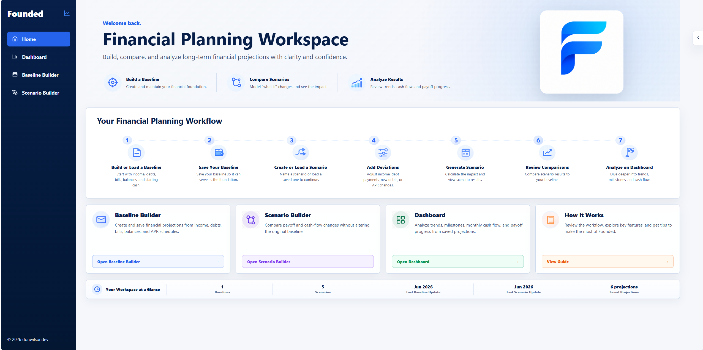
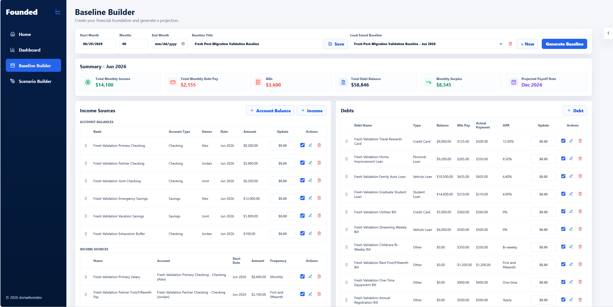
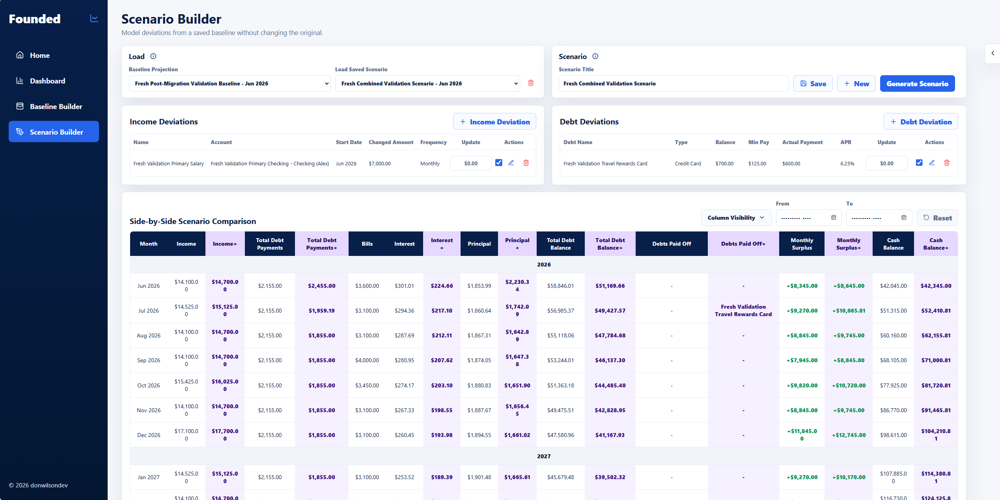
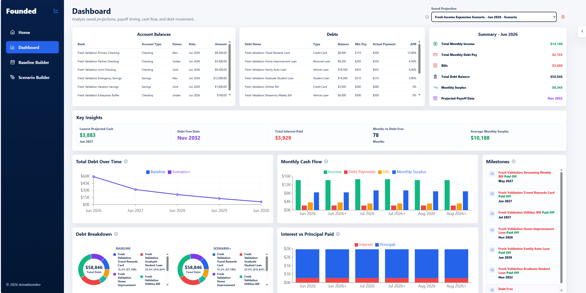

# Founded

**Founded** is a full-stack personal financial planning platform that helps individuals and households build a financial foundation, forecast long-term cash flow, evaluate debt payoff strategies, and compare financial scenarios through an intuitive, data-driven experience.

Built with **React**, **Node.js**, **Express**, and **MongoDB**, Founded combines long-term financial forecasting with interactive dashboards to help users better understand how today's financial decisions impact tomorrow's financial health.

---

## Home



Prefer to explore the application without installing it locally?

**Website:** https://founded.donwilson-dev.com

---

## Baseline Builder

Build your financial foundation by creating the household you'll project against.

The Baseline Builder allows you to configure:

- Accounts and account owners
- Income sources
- Debts and loans
- Bills and recurring expenses
- Transfers between accounts

This baseline becomes the single source of truth for every future projection and scenario.



---

## Scenario Builder

Explore "what-if" situations without affecting your original financial plan.

Create and compare scenarios such as:

- Debt payoff acceleration
- Income increases
- Expense changes
- New recurring costs
- Financial life events

Scenarios inherit the baseline while allowing targeted deviations for comparison.



---

## Dashboard

Analyze projected financial performance through an interactive dashboard featuring:

- Projection summaries
- Cash balance trends
- Debt payoff tracking
- Monthly financial metrics
- Milestone visualization
- Scenario comparison

Projection data can be exported to **CSV**, **Excel**, and **PDF** formats for further analysis or record keeping.



---

# Key Features

- Personal and household financial planning
- Long-term cash flow projections
- Baseline financial modeling
- Scenario comparison engine
- Debt payoff forecasting
- Multi-account financial management
- Interactive dashboard analytics
- Projection exports (CSV, Excel, PDF)
- MongoDB-backed persistence
- Desktop and tablet optimized interface

---

# Technology Stack

### Frontend

- React
- Vite
- React Router
- JavaScript

### Backend

- Node.js
- Express

### Database

- MongoDB Community Server

### Export Support

- CSV
- Excel (.xlsx)
- PDF

---

# Repository Structure

```text
backend/
├── controllers/
├── models/
├── routes/
├── services/
├── tests/

frontend/
├── src/
│   ├── api/
│   ├── assets/
│   ├── components/
│   └── pages/

docs/
└── images/
```

---

# Getting Started

## Install Dependencies

```powershell
cd backend
npm install

cd ..\frontend
npm install
```

---

## Configure MongoDB

Ensure **MongoDB Community Server** is installed and running locally.

Create a `backend/.env` file using `backend/.env.example`.

Typical local connection:

```text
MONGODB_URI=mongodb://127.0.0.1:27017/founded
```

---

## Run the Backend

```powershell
cd backend
node server.js
```

Health endpoint:

```text
http://127.0.0.1:4000/health
```

---

## Run the Frontend

```powershell
cd frontend
npm run dev
```

The frontend is served by Vite on **http://localhost:5173** by default. If port 5173 is already in use, Vite will automatically select the next available port and display the correct URL in the terminal.

By default, the frontend communicates with the backend at:

```text
http://127.0.0.1:4000
```

To use a different backend, configure:

```text
VITE_API_BASE_URL
```

---

# Validation

Verify that the application builds successfully and backend tests pass before running or contributing.

### Backend

```powershell
cd backend

npm test
npm run dataset:verify
```

### Frontend

```powershell
cd frontend

npm run build
```

---

# Browser Support

Founded is designed for modern versions of:

- Google Chrome
- Microsoft Edge
- Mozilla Firefox

---

# Design Principles

Founded is built around a few core principles:

- Maintain a single financial source of truth through the Baseline.
- Enable safe financial experimentation using independent Scenarios.
- Preserve data integrity across all projections.
- Keep financial projections transparent and explainable.
- Deliver a clean, intuitive user experience focused on long-term financial planning.

---

## License

Copyright © 2026 donwilson-dev. All rights reserved.

This repository is provided for educational and portfolio purposes. No license is granted for redistribution or commercial use.
